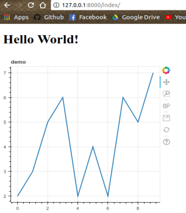

# How to embed bokeh plot in Django: Quick Start
This short tutorial is meant for people who want to embed Bokeh plot into Django.     
It does not include the comparison with others tools.

## Overviews (just two steps):
- Step 1. 畫出 bokeh 的圖 (figure)
- Step 2.       
    - Step 2-1. 將 bokeh plot decompose 成 script 和 div     
    - Step 2-2. 將 script 和 div 透過 jinja 語法傳到前端     
- Done !

## Quick Start Example:
### Step 1. Bokeh figure:    
A simple lineplot example in bokeh tutorial.

```python
from bokeh.plotting import figure

x = range(10)
y = [2,3,5,6,2,4,2,6,5,7]
title = 'demo'

plot = figure(title=title, plot_width=400, plot_height=400)
plot.line(x, y, line_width=2)
show(plot)
```    

Which may look like:    


### Step 2-1. Decompose to script and div:
Decompose the bokeh figure by just two lines.
```python
from bokeh.embed import components

script, div = components(plot)
```

### Step 2-2. Sent it to the frontend:
The full example code in `views.py` looks like this.
```python
from django.shortcuts import render
from bokeh.plotting import figure 
from bokeh.embed import components

def index(request):
    x = range(10)
    y = [2,3,5,6,2,4,2,6,5,7]
    title = 'demo'

    plot = figure(title=title, plot_width=400, plot_height=400)
    plot.line(x, y, line_width=2)
    script, div = components(plot)

    return render(request,
    		  'bokeh_demo/index.html',
    	          {'script': script, 'div': div})
```    
The full example code in `index.html` looks like this.
```html
<!DOCTYPE html>
<html lang="en">
    <head>
	 <meta charset="UTF-8">
	 <title>Document</title>
         <!--  Bokeh CSS and JS -->
	 <link href="http://cdn.pydata.org/bokeh/release/bokeh-0.12.15.min.css" rel="stylesheet" type="text/css">
	 <link href="http://cdn.pydata.org/bokeh/release/bokeh-widgets-0.12.15.min.css" rel="stylesheet" type="text/css">
	 <script src="http://cdn.pydata.org/bokeh/release/bokeh-0.12.15.min.js"></script>
	 <script src="http://cdn.pydata.org/bokeh/release/bokeh-widgets-0.12.15.min.js"></script>
         <!-- # # # # # # # # # -->
    </head>
    <body>
	 <h1>Hello World!</h1>
	 {{ div | safe }}
	 {{ script | safe }}
    </body>
</html>
```    
#### Notice that you need to add Bokeh CSS and JS in your `html file`.    
#### Also, the corresponding version must be matched.    

Finally, the result will look like this:    
The full django code can be found at the same folder.     

