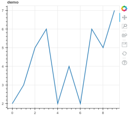

# How to embed bokeh plot in Django: Quick Start

## 兩個步驟 :
- Step1. 畫出 bokeh 的圖 (figure)
- Step2. Decompose 成 script 和 div 後傳到前端 (透過 jinja)
- Done !

## Quick Start Example:
- **Step1. Bokeh figure:**    
A simple lineplot example in bokeh tutorial
```python
x = range(10)
y = [2,3,5,6,2,4,2,6,5,7]
title = 'demo'

plot = figure(title=title, plot_width=400, plot_height=400)
plot.line(x, y, line_width=2)
script, div = components(plot)
```    
which may look like    




- **Step2. Decompose to script and div, then sent it to the frontend**

